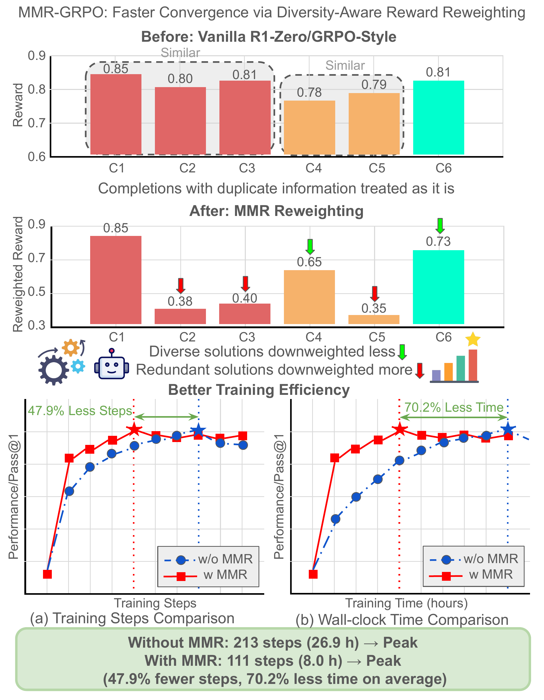
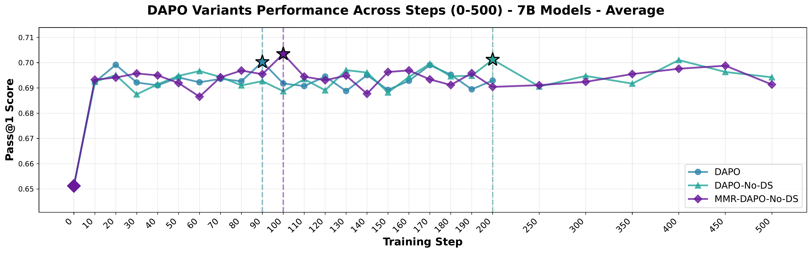
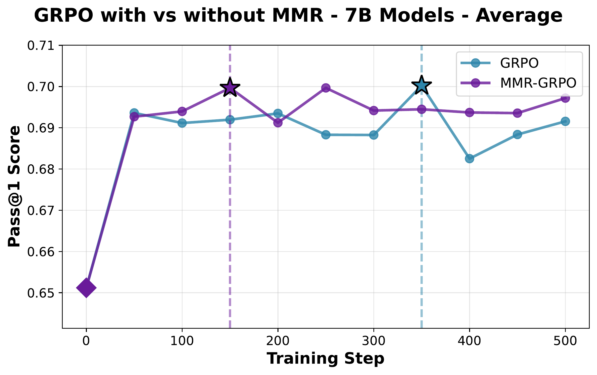
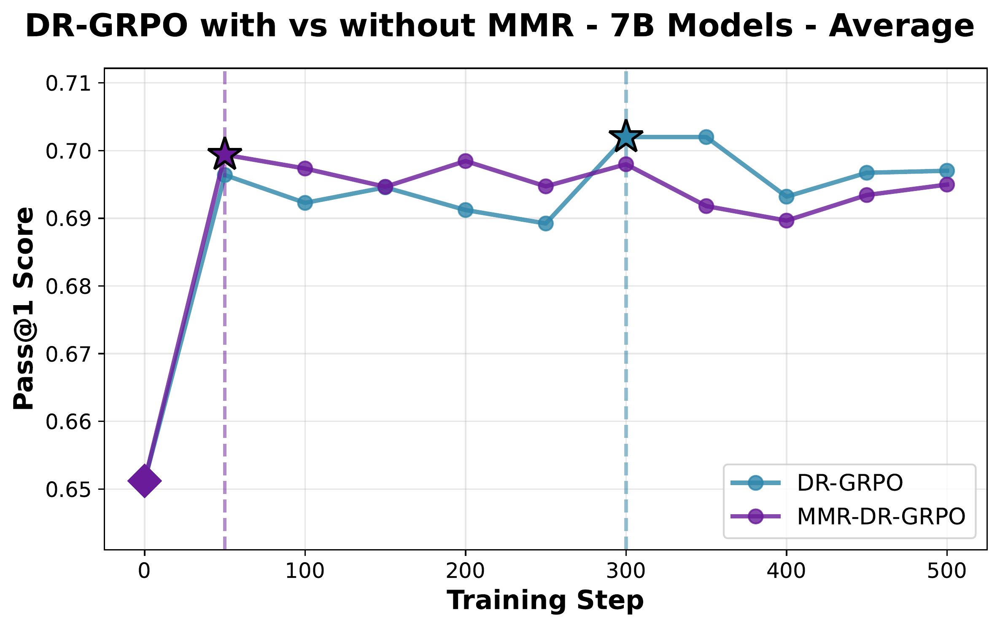

<h1 align="center">MMR-GRPO</h1>

<h3 align="center">Accelerating GRPO-Style Training through Diversity-Aware Reward Reweighting</h3>

<p align="center">
  <a href="https://2026.aclweb.org/"></a>
  <a href="https://arxiv.org/abs/2601.09085"></a>
  <a href="LICENSE"></a>
  <a href="https://github.com/WeiKangda/MMR-GRPO"></a>
</p>

---

<p align="center">
  
</p>

<p align="center"><i>
Before MMR, all completions receive similar weights despite semantic redundancy. After MMR reweighting, diverse solutions maintain high weights while redundant ones are downweighted — achieving <b>47.9% fewer training steps</b> and <b>70.2% less wall-clock time</b>.
</i></p>

## Overview

Group Relative Policy Optimization (GRPO) has become a standard approach for training mathematical reasoning models, but its reliance on multiple completions per prompt makes training computationally expensive. **MMR-GRPO** integrates [Maximal Marginal Relevance (MMR)](https://dl.acm.org/doi/10.1145/290941.291025) into the reward computation to reweigh rewards based on completion diversity. The key insight is that semantically redundant completions contribute limited marginal learning signal — prioritizing diverse solutions yields more informative policy updates and accelerates convergence.

**Highlights:**
- Achieves comparable peak performance while requiring **47.9% fewer training steps** on average
- **70.2% less wall-clock time** on average
- Only **1–5% per-step computational overhead**
- **Parameter-free**: adaptive λ mechanism eliminates hyperparameter tuning
- Consistent across **3 model sizes** (1.5B, 7B, 8B), **3 GRPO variants** (GRPO, DR-GRPO, DAPO), and **5 mathematical reasoning benchmarks**

## Key Results

### Main Results (pass@1, n=16)

| Size | Method | AIME 24 | MATH-500 | AMC 23 | Minerva | OlympiadBench | **Avg** | **Peak Step** | **Time (hrs)** |
|:--:|:--|:--:|:--:|:--:|:--:|:--:|:--:|:--:|:--:|
| **1.5B** | GRPO | 0.338 | 0.846 | 0.730 | 0.296 | 0.528 | 0.547 | 100 | 4.08 |
| | **MMR-GRPO** | 0.325 | 0.849 | 0.739 | 0.302 | 0.528 | **0.549** | **100** | **4.13** |
| | DR-GRPO | 0.335 | 0.844 | 0.744 | 0.297 | 0.523 | 0.549 | 150 | 6.11 |
| | **MMR-DR-GRPO** | 0.323 | 0.851 | 0.738 | 0.303 | 0.530 | **0.549** | **100** | **4.13** |
| | DAPO | 0.331 | 0.851 | 0.755 | 0.304 | 0.541 | 0.556 | 110 | 25.53 |
| | **MMR-DAPO-No-DS** | 0.331 | 0.856 | 0.730 | 0.295 | 0.527 | **0.548** | **170** | **7.72** |
| **7B** | GRPO | 0.554 | 0.940 | 0.917 | 0.418 | 0.671 | 0.700 | 350 | 28.28 |
| | **MMR-GRPO** | 0.560 | 0.940 | 0.916 | 0.409 | 0.673 | **0.700** | **150** | **12.22** |
| | DR-GRPO | 0.565 | 0.939 | 0.914 | 0.420 | 0.672 | 0.702 | 300 | 24.30 |
| | **MMR-DR-GRPO** | 0.565 | 0.942 | 0.905 | 0.412 | 0.673 | **0.699** | **50** | **4.11** |
| | DAPO | 0.558 | 0.940 | 0.914 | 0.418 | 0.671 | 0.700 | 90 | 33.15 |
| | **MMR-DAPO-No-DS** | 0.567 | 0.941 | 0.920 | 0.417 | 0.672 | **0.703** | **100** | **8.52** |
| **8B** | GRPO | 0.465 | 0.889 | 0.897 | 0.355 | 0.626 | 0.646 | 350 | 32.22 |
| | **MMR-GRPO** | 0.475 | 0.882 | 0.897 | 0.350 | 0.623 | **0.645** | **50** | **4.62** |
| | DR-GRPO | 0.488 | 0.895 | 0.881 | 0.351 | 0.632 | 0.649 | 300 | 27.72 |
| | **MMR-DR-GRPO** | 0.485 | 0.893 | 0.886 | 0.346 | 0.630 | **0.648** | **100** | **9.36** |
| | DAPO | 0.504 | 0.889 | 0.889 | 0.351 | 0.631 | 0.653 | 160 | 93.75 |
| | **MMR-DAPO-No-DS** | 0.477 | 0.888 | 0.878 | 0.353 | 0.631 | **0.646** | **180** | **17.40** |

> All metrics represent the best checkpoint. Training time is wall-clock on 2×NVIDIA H100 80GB GPUs.

### Convergence Curves (7B Models)

<p align="center">
  <br>
  
  
</p>

<p align="center"><i>MMR variants consistently achieve faster convergence across all three training methods.</i></p>

## Installation

Our code is built on top of [Open-RS](https://github.com/knoveleng/open-rs). **Training and evaluation require two separate environments** because the version of `lighteval` used during training (git commit `ed08481`) does not support the `pass@1` metric with `n=16` sampling. A newer environment with `lighteval >= 0.12.2` is needed for proper evaluation.

### Training Environment (`mmr_grpo`)

Requires **CUDA 12.4** (bundled with `torch==2.5.1`).

```bash
uv venv mmr_grpo --python 3.11.7
source mmr_grpo/bin/activate
uv pip install -r requirements_train.txt
huggingface-cli login
wandb login
```

> **Important:** This repo includes a customized `trl` package under `src/open_r1/trl/`. Do **not** reinstall `trl` from pip — it will overwrite the modifications needed for MMR reweighting.

<details>
<summary><b>Key packages in training environment</b></summary>

| Package | Version |
|---------|---------|
| torch | 2.5.1 |
| vllm | 0.7.2 |
| accelerate | 1.4.0 |
| datasets | 3.2.0 |
| trl | custom (git `69ad852`, included in repo) |
| lighteval | git (`ed08481`) |
| CUDA | 12.4.x |

Additional training-only packages: `bitsandbytes`, `flash-attn`, `peft`, `deepspeed`, `sentence-transformers`, `math-verify`
</details>

### Evaluation Environment (`mmr_grpo_eval`)

Requires **CUDA 12.6** (bundled with `torch==2.7.1`). A separate environment is required because the training-era `lighteval` (git commit `ed08481`) does **not** support `pass@1` with `n=16` (multi-sample evaluation). We use `lighteval >= 0.12.2` from PyPI which supports this metric properly.

```bash
uv venv mmr_grpo_eval --python 3.11.7
source mmr_grpo_eval/bin/activate
uv pip install -r requirements_eval.txt
```

<details>
<summary><b>Key packages in evaluation environment</b></summary>

| Package | Version |
|---------|---------|
| torch | 2.7.1 |
| vllm | 0.10.0 |
| accelerate | 1.11.0 |
| datasets | 4.4.1 |
| lighteval | 0.12.2 (PyPI) |
| CUDA | 12.6.x |

Additional eval-only packages: `cupy-cuda12x`, `numba`, `llguidance`
</details>

## Training

All training uses 2×H100 GPUs with DeepSpeed ZeRO Stage 2. Training data: [`knoveleng/open-rs`](https://huggingface.co/datasets/knoveleng/open-rs) (~7,000 math reasoning problems).

### MMR-GRPO

```bash
ACCELERATE_LOG_LEVEL=info accelerate launch \
  --main_process_port 11188 \
  --config_file recipes/accelerate_configs/zero2.yaml \
  --num_processes=3 \
  src/open_r1/grpo.py \
  --config recipes/mmr_grpo.yaml        # 1.5B (default)
  # --config recipes/mmr_grpo_7b.yaml   # 7B
  # --config recipes/mmr_grpo_8b.yaml   # 8B
```

### MMR-DR-GRPO

```bash
ACCELERATE_LOG_LEVEL=info accelerate launch \
  --main_process_port 18007 \
  --config_file recipes/accelerate_configs/zero2.yaml \
  --num_processes=3 \
  src/open_r1/drgrpo.py \
  --config recipes/mmr_dr_grpo.yaml        # 1.5B (default)
  # --config recipes/mmr_dr_grpo_7b.yaml   # 7B
  # --config recipes/mmr_dr_grpo_8b.yaml   # 8B
```

### MMR-DAPO-No-DS

```bash
ACCELERATE_LOG_LEVEL=info accelerate launch \
  --main_process_port 18007 \
  --config_file recipes/accelerate_configs/zero2.yaml \
  --num_processes=3 \
  src/open_r1/dapo.py \
  --config recipes/mmr_dapo.yaml        # 1.5B (default)
  # --config recipes/mmr_dapo_7b.yaml   # 7B
  # --config recipes/mmr_dapo_8b.yaml   # 8B
```

Checkpoints are automatically uploaded to Hugging Face during training via W&B integration.

## Evaluation

> **Use the `mmr_grpo_eval` environment for evaluation** to get correct `pass@1` (n=16) metrics.

```bash
source activate mmr_grpo_eval

MODEL="<your-model-or-checkpoint>"
MODEL_NAME=$(basename "$MODEL")
TASKS="math_500 amc23 minerva olympiadbench aime24"
OUTPUT_DIR="data-test/evals/${MODEL_NAME}"

MODEL_ARGS="pretrained=$MODEL,dtype=bfloat16,max_model_length=32768,gpu_memory_utilization=0.8,generation_parameters={max_new_tokens:32768,temperature:0.6,top_p:0.95}"

for TASK in $TASKS; do
  lighteval vllm "$MODEL_ARGS" "custom|$TASK|0|0" \
    --custom-tasks src/open_r1/evaluate.py \
    --use-chat-template \
    --output-dir "$OUTPUT_DIR"
done
```

Evaluation requires only **1 GPU**. We evaluate on 5 benchmarks:
- **MATH-500** — 500 high school competition problems
- **AIME 2024** — 30 American Invitational Mathematics Examination problems
- **AMC 2023** — 40 AMC 10/12 competition problems
- **Minerva Math** — 272 undergraduate-level STEM problems
- **OlympiadBench** — 675 olympiad-level problems

## Citation

If you find this work useful, please cite:

```bibtex
@misc{wei2026mmrgrpoacceleratinggrpostyletraining,
      title={MMR-GRPO: Accelerating GRPO-Style Training through Diversity-Aware Reward Reweighting}, 
      author={Kangda Wei and Ruihong Huang},
      year={2026},
      eprint={2601.09085},
      archivePrefix={arXiv},
      primaryClass={cs.LG},
      url={https://arxiv.org/abs/2601.09085}, 
}
```

## Acknowledgements

Our code is built on top of [Open-RS](https://github.com/knoveleng/open-rs) and [Hugging Face TRL](https://github.com/huggingface/trl). We thank the authors for open-sourcing their work.
